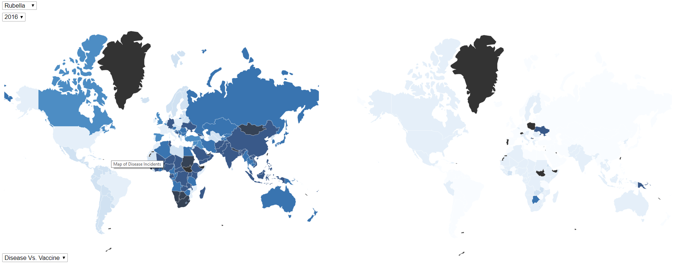

Process Book
===

Overview and Motivation
---

According to a New York Times article appropriately titled Measles Cases in Europe Quadrupled in 2017, "the [measles] virus found its way into pockets of unvaccinated children all over the continent" (https://www.nytimes.com/2018/02/23/health/measles-europe.html?smid=fb-nytscience&amp;smtyp=cur&mtrref=undefined). 

Related Work
---

This is the World Health Orgnaization visualization of our primary two data sources (http://www.who.int/immunization/monitoring_surveillance/data/en/).  Our intent was to improve upon this image.

From the New York Times article "Here Are the Places That Struggle to Meet the Rules on Safe Drinking Water" (https://www.nytimes.com/2018/02/12/climate/drinking-water-safety.html), this visualization inspired the design choices for our visualization.

Data
---

Exploratory Data Analysis
---

Design Evolution
----

## Proposal Design

Initially, for our proposal we really wanted to make a map comparing disease and vaccine. We discussed a variety of options off of the map design when coming up with our proposal, but ultimately the map was the clearest way to display all the data we wanted.

Our initial design attempted to use multiple visual channels to produce a single cohesive map which included all of the data.

While we liked this design, our reasons for revising it were based around feedback we received. 

## Post Proposal Design Session 2/19

After our proposal, we received feedback that it was difficult for the user to remember data they had seen before, and that we should be adding functionality so that the user could directly compare aspects that were important rather than comparing between views. The proposal feedback has brought up the option of doing small multiples which was something that we explored at the time. ML also particularly liked the layout of this water quality map  that featured one large map and several smaller maps:

After discussing and brainstorming, we came up with the 4 possibilities in the image below:

1. Keeping our original design choice but since our comparison point was disease vs. vaccine which were also both focused on the map. We decided ultimately that while the feedback that we got from the proposal (that people aren't good at comparing across diseases when they have to switch views) wasn't really what our focus was, it was fair to say that our vaccine vs. disease comparison might have been less obvious with our design which was why the incorrect conclusion was drawn by those reading the proposal.

2. Doing a collection of a bunch of tiny maps on an axis sorted by disease and time for comparison. We decided against this for two reasons. First of all, we had a lot of differences we were interested in showing to the user, and so doing a bunch of small maps would have either involved a ton of scrolling for the user, or would have made each map so small that they would have been difficult to read. We didn't think that either of these was an acceptable situation. We also debating making it so that the visualization would zoom in to each map as you moused over the map, but since the user would not be able to be moused over more than one map at once, that had the same issue as the original design with cognitive load increase for comparison maps. Thus this idea was rejected.

3.  We debated showing disease (possibly vs. vaccine usage) just over time. This allowed us to fit more maps on the screen and also made scrolling make more sense than in the second design. However, this still made it difficult to compare disease rates from years not next to each other, and made the visualization much larger and more confusing.

4. We finally settled on doing just two maps, one for disease incidents and one for vaccine percentage. This allowed us to focus the user intention on the particular thing that we wanted them to be comparing (vaccine prevalence vs.  disease incidents) and didn't distract them with too much information at once that might be hard to take in. It was also an improvement over our original design because it avoided having the users try to make comparisons between area for vaccine and color for disease which would have been difficult. Instead users have to compare the same visual channel (saturation) for a vaccine map and a disease map that are side by side.

## Initial Map 2/20

Initially our MVP was just to have a single map that showed disease prevalence so that we had something that could show how disease has gone away over time due to the increase of vaccines. We completed that in blue (bad color choice) as can be seen below.

## Disease Vs. Vaccine Placeholder 2/21

The next day we were able to make a disease vs. vaccine map with a placeholder square for the vaccine map. In this iteration, the design was to have the vaccine map have it's own selector for disease and year. In this progress shot, the placeholder square changes colors to orange on disease change. 

![Map with Placeholder] (img/PartialProgressTowards2Maps.png)

## Disease Vs. Disease 2/22

On February 22nd, the data for vaccine information was not yet available a "placeholder" map was made using just the disease information. When we actually looked at the disease maps though, there was some interesting insights that we thought that the user could pull out of looking at maps in that manner like comparing measles now to measles in 2001 and seeing how the disease prevalence has decreased due to vaccines. This caused us to revise our design to include a second mode.

![Disease Vs. Disease] (img/DiseaseVsDisease.png)

## Disease Vs. Vaccine Multiple Modes 2/22

In this iteration, we added the second mode for vaccine. Since vaccine vs. disease was the primary comparison we wanted viewers to make, we made it the automatic mode. We also came to the design decision to always make the vaccine map match the disease map by removing the selector options for vaccine. This version still did not have sensible color buckets.

## Color Bin Decisions 2/26

In order to decide where to make our bins, we decided to use the power of math! Instead of just making a gut decision on the best bins, we plotted the data on a histogram in order to see how our data was clustered and to pick bins that would best show our data. 

Unfortunately, when we took a closer look at the vaccine data, we found that there were multiple values that were over 100 percent. At first, we assumed that this was ok as the actual vaccine amounts were looking at a target group for vaccination and calculating a vaccination percentage based on doses administered vs. that target group. Some countries appeared to have vaccinated people who were not part of their target group. However, upon inspection, it appeared that some countries had reported very low target group numbers (a dozen people instead of thousands) in order to make their vaccination percentage higher. Since this data was suspect, we decided to exclude data that was over a certain value in order to protect the integrity of our visualization against data that we considered suspect. 

## Legend addition and minor improvements

After choosing colors, we were able to clean up our design and add legends to help the user. 

![Disease Vs. Disease Final] (img/DiseaseVsDiseaseFinal.png)

---

Evaluation
---

Teams
---

ML focused on our data. She did pretty much all of the data manipulation. She also gathered most of the research on our background and motivation.
Brittany and Russell focused mostly on the programming for building the visualization. Russell's contributions focused mostly around finding good base code and examples and implementing the selector. Brittany focused on getting the data maps to change correctly according the selectors and doing a lot of the changes to the "backbone" of the code. 
All of us contributed to the proposal and final project supplemental materials. 

