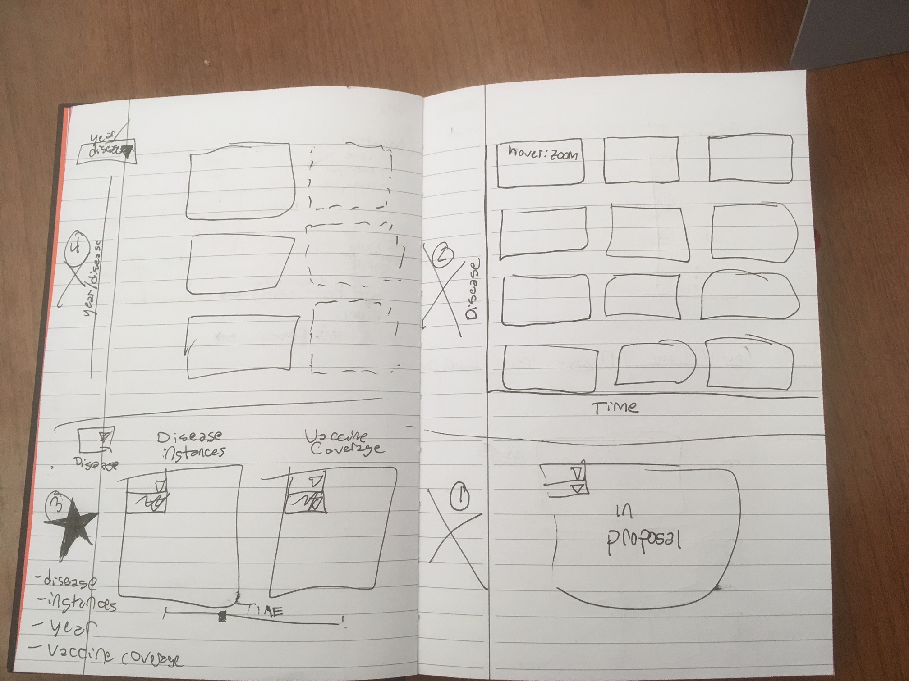

Process Book
===

Russell Davis (rdavis@wpi.edu Github: russbdavis) contributed to visualization prototyping, implementation of visualization aestetics, and screencasting. 

Brittany Gradel (bgradel@wpi.edu Github: bgradel) contributed to the bulk of the visualization. 

ML Tlachac (mltlachac@wpi.edu, Github: mltlachac) contribution to data acquistion, exploration, and manipulation. 

All team members contributed to visualization motivation, design developmentation, and written deliverables. 

Overview
---

Motivation
---

Measles is one of the leading causes of death among children according to the World Health Organization. In 2016, measles was the cause of death for nearly 90,000 children globally, the fewest annual deaths ever (http://www.who.int/mediacentre/factsheets/fs286/en/). This is particularily tragic as the spread of the disease is preventable through vaccination. Unfortunatly, instead of increasing vaccination rates, vaccines are becoming less popular in developed countries were the diseases are less prevelant.  According to a New York Times article appropriately titled Measles Cases in Europe Quadrupled in 2017, "the [measles] virus found its way into pockets of unvaccinated children all over the continent" (https://www.nytimes.com/2018/02/23/health/measles-europe.html?smid=fb-nytscience&amp;smtyp=cur&mtrref=undefined). 

An increasing number of parents hesitate to vaccinate their children out of fear. Stemming primarily from a misguided belief that vaccines have negative consequences such as autism, mercury poisoning, or chemical overloads, parents are either delaying or refusing to have their children vaccinated.  Over ten percent of parents choose to delay or skip a standard vaccination (https://communitytable.parade.com/109306/sethmnookin/07-why-so-many-parents-are-delaying-vaccines/).  This not only puts their child at risk but also vulnerable members of the community such as infants, elderly, pregnant women, and those with prexisting health problems.

Even after the autism myth was debunked and the 'mercury mom' trend faded, these concerns are kept alive by the media and the public (https://communitytable.parade.com/109306/sethmnookin/07-why-so-many-parents-are-delaying-vaccines/).  In addition, new concerns continue surface to plague the reputation of vaccines.  In fact, fear regarding chemical overload has led to alternative vaccine schedules that delay vaccine administration, such as Dr. Sear's vaccine solution (http://www.loving-attachment-parenting.com/alternative-vaccination-schedule-dr-sears.html).  "The Truth about Vaccines" documentary uses fear to propegate common myths about vaccines as well as stating other reasons vaccines are unsafe (https://vaccinesworkblog.wordpress.com/2017/04/16/the-truth-about-vaccines-episode-1-top-ten-lies-debunked/).  The lies and misrepresentation in this documenary are convincing previously pro-vaccine parents that vaccines are dangerous to their children.

Our goal is to demonstrate to the general public through visualization that vaccines are important for preventing diseases.  This is accomplished through enabling a direct comparison between disease incidence and vaccination rates for a given year.  In addition, comparison between diseases at different points in time can highlight the broad impact of vaccinations.  As the fear of vaccination is founded in misinterpretation of science, our visualization is designed to be accessible to our target audience by being simple, direct, and easy to interpret.

Related Work
---

This is the World Health Orgnaization visualization of our primary two data sources (http://www.who.int/immunization/monitoring_surveillance/data/en/).  Our intent was to improve upon this image.

From the New York Times article "Here Are the Places That Struggle to Meet the Rules on Safe Drinking Water" (https://www.nytimes.com/2018/02/12/climate/drinking-water-safety.html), this visualization inspired the design choices for our visualization.

Data
---

Exploratory Data Analysis
---

Design Evolution
----

## Proposal Design

Initially, for our proposal we really wanted to make a map comparing disease and vaccine. Our initial design attempted to use multiple visual channels to produce a single cohesive map which included all of the data.

While we liked this design, our reasons for revising it were based around feedback we received. 

## Post Proposal Design Session 2/19

After our proposal, we received feedback that it was difficult for the user to remember data they had seen before, and that we should be adding functionality so that the user could directly compare aspects that were important rather than comparing between views. The proposal feedback has brought up the option of doing small multiples which was something that we explored at the time. ML also particularly liked the layout of this water quality map  that featured one large map and several smaller maps:

After discussing and brainstorming, we came up with the 4 possibilities in the image below:

1. Keeping our original design choice but since our comparison point was disease vs. vaccine which were also both focused on the map. We decided ultimately that while the feedback that we got from the proposal (that people aren't good at comparing across diseases when they have to switch views) wasn't really what our focus was, it was fair to say that our vaccine vs. disease comparison might have been less obvious with our design which was why the incorrect conclusion was drawn by those reading the proposal.

2. Doing a collection of a bunch of tiny maps on an axis sorted by disease and time for comparison. We decided against this for two reasons. First of all, we had a lot of differences we were interested in showing to the user, and so doing a bunch of small maps would have either involved a ton of scrolling for the user, or would have made each map so small that they would have been difficult to read. We didn't think that either of these was an acceptable situation. We also debating making it so that the visualization would zoom in to each map as you moused over the map, but since the user would not be able to be moused over more than one map at once, that had the same issue as the original design with cognitive load increase for comparison maps. Thus this idea was rejected.

3.  We debated showing disease (possibly vs. vaccine usage) just over time. This allowed us to fit more maps on the screen and also made scrolling make more sense than in the second design. However, this still made it difficult to compare disease rates from years not next to each other, and made the visualization much larger and more confusing.

4. We finally settled on doing just two maps, one for disease incidents and one for vaccine percentage. This allowed us to focus the user intention on the particular thing that we wanted them to be comparing (vaccine prevalence vs.  disease incidents) and didn't distract them with too much information at once that might be hard to take in. It was also an improvement over our original design because it avoided having the users try to make comparisons between area for vaccine and color of disease which would have been messy.

Implementation
---

Evaluation
---

