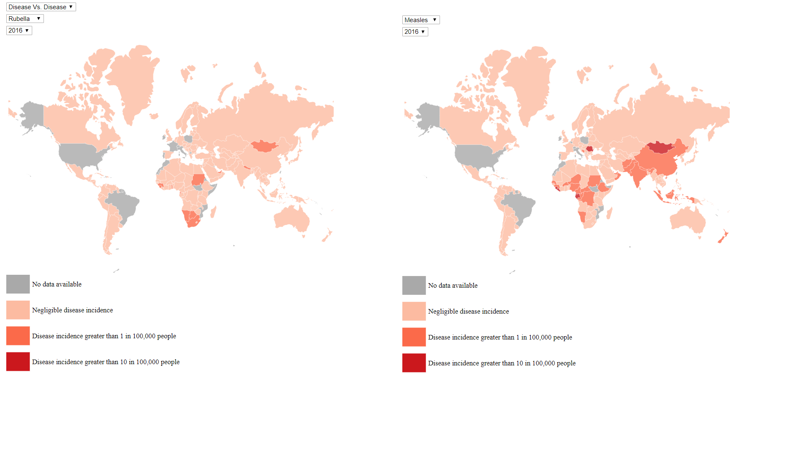

Process Book
===

Russell Davis (rdavis@wpi.edu Github: russbdavis) contributed to visualization prototyping, implementation of visualization aesthetics, and screen-casting. 

Brittany Gradel (bgradel@wpi.edu Github: bgradel) contributed to the bulk of the visualization coding and the website. 

ML Tlachac (mltlachac@wpi.edu, Github: mltlachac) contribution to data acquisition, exploration, and manipulation. 

All team members contributed to visualization motivation, design development, and written deliverables. 

Goal Overview and Motivation
---

Measles is one of the leading causes of death among children according to the World Health Organization. In 2016, measles was the cause of death for nearly 90,000 children globally, the fewest annual deaths ever (http://www.who.int/mediacentre/factsheets/fs286/en/). This is particularly tragic as the spread of the disease is preventable through vaccination. Unfortunately, instead of increasing vaccination rates, vaccines are becoming less popular in developed countries were the diseases are less prevalent.  According to a New York Times article appropriately titled Measles Cases in Europe Quadrupled in 2017, "the [measles] virus found its way into pockets of unvaccinated children all over the continent" (https://www.nytimes.com/2018/02/23/health/measles-europe.html?smid=fb-nytscience&amp;smtyp=cur&mtrref=undefined). 

An increasing number of parents hesitate to vaccinate their children out of fear. Stemming primarily from a misguided belief that vaccines have negative consequences such as autism, mercury poisoning, or chemical overloads, parents are either delaying or refusing to have their children vaccinated.  Over ten percent of parents choose to delay or skip a standard vaccination (https://communitytable.parade.com/109306/sethmnookin/07-why-so-many-parents-are-delaying-vaccines/).  This not only puts their child at risk but also vulnerable members of the community such as infants, elderly, pregnant women, and those with prexisting health problems.  These people rely on herd immunity, which is when enough of the population are vaccinated to keep the disease from spreading  (http://www.pbs.org/wgbh/nova/body/herd-immunity.html).  As such, it is important for everyone to understand the importance of vaccinating, for themselves and their communities. 

However, even after the autism myth was debunked and the 'mercury mom' trend faded, these concerns are kept alive by the media and the public (https://communitytable.parade.com/109306/sethmnookin/07-why-so-many-parents-are-delaying-vaccines/).  In addition, new concerns continue surface to plague the reputation of vaccines.  In fact, fear regarding chemical overload has led to alternative vaccine schedules that delay vaccine administration, such as Dr. Sear's vaccine solution (http://www.loving-attachment-parenting.com/alternative-vaccination-schedule-dr-sears.html).  "The Truth about Vaccines" documentary uses fear to propagate common myths about vaccines as well as stating other reasons vaccines are unsafe (https://vaccinesworkblog.wordpress.com/2017/04/16/the-truth-about-vaccines-episode-1-top-ten-lies-debunked/).  The lies and misrepresentation in this documentary are convincing previously pro-vaccine parents that vaccines are dangerous to their children.

Our goal is to demonstrate to the general public through visualization that vaccines are important for preventing diseases.  This is accomplished through enabling a direct comparison between disease incidence and vaccination rates for a given year.  By emphasizing the time-variant impact of vaccines with appropriate visual idioms, we hope to clearly illuminate their efficacy. In addition, comparison between diseases at different points in time can highlight the broad impact of vaccinations.  As the fear of vaccination is founded in misinterpretation of science, our visualization is designed to be accessible to our target audience by being simple, direct, and easy to interpret.  Our visualization attempts to hold the attention of our target audience by being interesting, interactive, and aesthetically pleasing.  Given these demands, we chose to proceed with a global map coded with color as our visualization. 

Related Work
---

This is the World Health Organization visualization of our primary two data sources (http://www.who.int/immunization/monitoring_surveillance/data/en/).  This visualization, while colorful, is boring to view and confusing to understand.  In particular, the channels are not used well.  Instead of a using hue in the color scale, either lightness or saturation should have been implemented.  In addition, using both color and size for circle channels while overlaying a blank map is a poor visualization choice.  Not only is it difficult to compare the size of circles, it is difficult to pinpoint where they belong on the map.  Lastly, this visualization falls victim to falsely displaying disease incidence without considering the overall population of the country, making countries with larger populations seem disproportionately troubled. Our intent is to improve upon this visualization to provide an easier to understand visualization for the same data.

From the New York Times article "Here Are the Places That Struggle to Meet the Rules on Safe Drinking Water" (https://www.nytimes.com/2018/02/12/climate/drinking-water-safety.html), this visualization inspired the design choices for our visualization.

This map example was both a starting point for our code and also a huge inspiration for how we wanted our map to look and feel. 

Questions
---

Our initial intent was to focus on questions regarding the costs of failing to vaccinate, both human and financial.  This was intended as a direct and impactful way of presenting the repercussions of failing to vaccinate: "How much money is it likely to cost you? How likely is your child to die as a result of your decision?"  We hoped to obtain data dating back to the mid-20th century when vaccines were first developed in order to see the impact of their adoption and draw comparisons that way.

However, issues with data procurement and cleaning, discussed below, limited our ability to answer these questions and necessitated a different perspective.  The data about specific diseases is limited to incidence in individuals; however, we also
found data specifically about vaccination rates, which enabled us to represent both incidence rates and vaccination rates.

This led to our primary question being: "What is the correlation between incidence and vaccination rates?"  

Because we had access to incidence rates across a period of 20 years and for a few different diseases, we were able to flesh this out into some more detailed questions: "How do vaccination rates affect incidence over time?" and "How do incidence rates of different diseases compare at the same point in time?"  This latter question is of less interest to those who are choosing whether or not to vaccinate, but allows for some exploratory analysis by more a research-minded audience.  

Our issues with data collection also led to a somewhat rhetorical question: "Why is the available data on disease and vaccination rates so limited?"   Our initial questions would likely have led to more powerful results by making the consequences of a failure to vaccinate extremely personal, but the data to support that question was simply unavailable.  As such, we hope that another use of this visualization is to highlight the difficulties imposed by this question.

Data
---

## Data Description and Source

This project mainly incorporates two different downloadable datasets from WHO: one on vaccines and one on diseases (http://www.who.int/immunization/monitoring_surveillance/data/en/).  The Vaccine dataset contains 8 features and the Disease dataset contains 42 features. Both contain three location variables: name, region, and county. The Vaccine dataset also contains vaccine, year (2000-2016), target population, administered doses, and percent coverage.  There are 49,903 rows in this Vaccine dataset. The Disease dataset also contains the disease and the number of cases for each year between 1980 and 2000.  There are 194 rows for each of the 10 different diseases (though one disease is a subset of another disease).  Both datasets contain many missing values from countries where there is not vaccine rate or disease incidence data available.

We also have two supporting datasets.  The first is downloadable country population data from the World Bank (https://data.worldbank.org/indicator/SP.POP.TOTL).  This dataset contains the country name and code, indicator name and code, and the population for every year between 1960 and 2016 for 264 countries.  Lastly, we also include data from Epidemiological Reviews found in a Nova article (http://www.pbs.org/wgbh/nova/body/herd-immunity.html).  This data required us to manually add it to a useable format, however it only contains 3 features and 7 rows of data.  The features include the disease, the basic reproduction number, and the herd immunity threshold.  

## Data Cleaning

There was a substantial amount of data cleaning.  First we wanted to decide what subset of the data we wished to use in our visualization.  In addition to the plentifiul missing values in the dataset, there were also many zeros in the Disease dataset for less common diseases.  For instance, if we built a global map for polio instances, we would have only a dozen instances in a couple of countries, which would not have the impact we were intending.  As such, we identified four diseases with the most disease instances: measles, mumps, pertussis, and rubella.  However, only vaccines for measles, pertussis, and rubella were included for these diseases.  Thus, we have only included these three diseases in our final data visualization.  However, the visualization could be expanded to include disease with available data.

As mentioned, there were many missing values.  We chose to keep these values as missing data may have meaning within the domain and as such gave them all a value of negative one.  After building the visualization, we noticed that there was no country code for Greenland in our dataset.  

Then we tried to merge the Disease, Population, and Vaccine datasets.  In particular, it was vital to merge the Disease and Population datasets to achieve the percent of the population with the disease.  This was done because it eliminates the issue of misreprentation of disease severity by scaling the number of infected by the population.  Also, disease percent makes more sense to compare to vaccine coverage which is also a percentage.  Merging the data highlighted some key concerns: each of three main datasets had a different number of country codes represented and the Vaccine dataset, in addition to have missing values, chose not to include certain rows of data.  While still possible to merge the Vaccine dataset, we realized it was not neccesary given that we already had vaccine coverage as a percent of the target population.  Instead, we just created three vaccine datasets, one for each of the selected diseases.  Then we merged Disease and Population datasets for the three selected diseases and used the information to feature engineer disease percent.

After merging the datasets, we noticed that some of the disease percents were 100 percent as both the numerator (disease instances) and denominator (population) were missing values and both coded as -1. As such, we adjusted these percents to -1 to represent that the data was missing.  This means that all disease percents with missing data are negative numbers. 

The last data cleaning challenge we faced was the realization that vaccine coverage was over 100 percent for 595 rows of the portion of the Vaccine dataset we are using, which included 103 countries.  We ponderered the correct way to handle this conundrum.  Given that this was not an issue isolated to a particular small subset of country, we acknowledged that there could be a logical reason for some of these values being over 100. Eventually, we decided that values slightly over 100 percent were acceptable but values more than slightly over 100 percent were probably errors.  We consulted the histogram of these questionable values below in making our determination of where that threshold belonged.  Any value over 115 was considred an error and coded the same as no data.

Exploratory Data Analysis
---

This is the World Health Orgnaization visualization of our primary two data sources (http://www.who.int/immunization/monitoring_surveillance/data/en/).  From this, we were able to see the quantity of the data that was available within the Disease and Vaccine datasets.  Thus, we knew that the data was appropriate for a global map visualization.

Apart from the histogram of the vaccine coverage values over 100 percent, we used histograms of the data to determine how to best bin the data.  Due to the herd immunity threshold in the last dataset, we had an inutition about how we wished to bin the vaccine coverage percent.  We validated that these divisions made sense given the distribution of total 9071 vaccine coverage values using the below histogram.

We had no intuition about the disease instances percent.  The minimum value for the disease instances percent was 0 and the maximum value for the disease instances percent was between 2-3 for all three of the Disease-Population datasets.  However, upon studying the data using the below histograms, we saw that the disease instances percent appeared to form a left skewed exponential distribution.  We adjusted our binning accordingly.

Design Evolution
----

## Proposal Design

Initially, for our proposal we really wanted to make a map comparing disease and vaccine. We discussed a variety of options off of the map design when coming up with our proposal, but ultimately the map was the clearest way to display all the data we wanted.

Our initial design attempted to use multiple visual channels to produce a single cohesive map which included all of the data.

While we liked this design, our reasons for revising it were based around feedback we received. 

## Post Proposal Design Session 2/19

After our proposal, we received feedback that it was difficult for the user to remember data they had seen before, and that we should be adding functionality so that the user could directly compare aspects that were important rather than comparing between views. The proposal feedback has brought up the option of doing small multiples which was something that we explored at the time. ML also particularly liked the layout of this water quality map  that featured one large map and several smaller maps:

After discussing and brainstorming, we came up with the 4 possibilities in the image below:

1. Keeping our original design choice but since our comparison point was disease vs. vaccine which were also both focused on the map. We decided ultimately that while the feedback that we got from the proposal (that people aren't good at comparing across diseases when they have to switch views) wasn't really what our focus was, it was fair to say that our vaccine vs. disease comparison might have been less obvious with our design which was why the incorrect conclusion was drawn by those reading the proposal.

2. Doing a collection of a bunch of tiny maps on an axis sorted by disease and time for comparison. We decided against this for two reasons. First of all, we had a lot of differences we were interested in showing to the user, and so doing a bunch of small maps would have either involved a ton of scrolling for the user, or would have made each map so small that they would have been difficult to read. We didn't think that either of these was an acceptable situation. We also debating making it so that the visualization would zoom in to each map as you moused over the map, but since the user would not be able to be moused over more than one map at once, that had the same issue as the original design with cognitive load increase for comparison maps. Thus this idea was rejected.

3.  We debated showing disease (possibly vs. vaccine usage) just over time. This allowed us to fit more maps on the screen and also made scrolling make more sense than in the second design. However, this still made it difficult to compare disease rates from years not next to each other, and made the visualization much larger and more confusing.

4. We finally settled on doing just two maps, one for disease incidents and one for vaccine percentage. This allowed us to focus the user intention on the particular thing that we wanted them to be comparing (vaccine prevalence vs.  disease incidents) and didn't distract them with too much information at once that might be hard to take in. It was also an improvement over our original design because it avoided having the users try to make comparisons between area for vaccine and color for disease which would have been difficult. Instead users have to compare the same visual channel (saturation) for a vaccine map and a disease map that are side by side.

## Initial Map 2/20

Initially our MVP was just to have a single map that showed disease prevalence so that we had something that could show how disease has gone away over time due to the increase of vaccines. We completed that in blue (bad color choice) as can be seen below.

## Disease Vs. Vaccine Placeholder 2/21

The next day we were able to make a disease vs. vaccine map with a placeholder square for the vaccine map. In this iteration, the design was to have the vaccine map have it's own selector for disease and year. In this progress shot, the placeholder square changes colors to orange on disease change. 

![Map with Placeholder] (img/PartialProgressTowards2Maps.png)

## Disease Vs. Disease 2/22

On February 22nd, the data for vaccine information was not yet available a "placeholder" map was made using just the disease information. When we actually looked at the disease maps though, there was some interesting insights that we thought that the user could pull out of looking at maps in that manner like comparing measles now to measles in 2001 and seeing how the disease prevalence has decreased due to vaccines. This caused us to revise our design to include a second mode.

![Disease Vs. Disease] (img/DiseaseVsDisease.png)

## Disease Vs. Vaccine Multiple Modes 2/22

In this iteration, we added the second mode for vaccine. Since vaccine vs. disease was the primary comparison we wanted viewers to make, we made it the automatic mode. We also came to the design decision to always make the vaccine map match the disease map by removing the selector options for vaccine. This version still did not have sensible color buckets.

## Color Bin Decisions 2/26

In order to decide where to make our bins, we decided to use the power of math! Instead of just making a gut decision on the best bins, we plotted the data on a histogram in order to see how our data was clustered and to pick bins that would best show our data. 

Unfortunately, when we took a closer look at the vaccine data, we found that there were multiple values that were over 100 percent. At first, we assumed that this was ok as the actual vaccine amounts were looking at a target group for vaccination and calculating a vaccination percentage based on doses administered vs. that target group. Some countries appeared to have vaccinated people who were not part of their target group. However, upon inspection, it appeared that some countries had reported very low target group numbers (a dozen people instead of thousands) in order to make their vaccination percentage higher. Since this data was suspect, we decided to exclude data that was over a certain value in order to protect the integrity of our visualization against data that we considered suspect. 

## Legend addition and minor improvements

After choosing colors, we were able to clean up our design and add legends to help the user. 

Implementation
---

Evaluation
---

