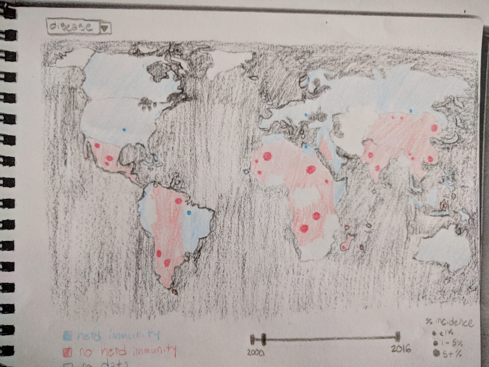

Process Book
===

Overview and Motivation
---

Related Work
---

This is the World Health Orgnaization visualization of our primary two data sources (http://www.who.int/immunization/monitoring_surveillance/data/en/).  Our intent was to improve upon this image.

From the New York Times article "Here Are the Places That Struggle to Meet the Rules on Safe Drinking Water" (https://www.nytimes.com/2018/02/12/climate/drinking-water-safety.html), this visualization inspired the design choices for our visualization.

Data
---

Exploratory Data Analysis
---

Design Evolution
----

# Proposal Design

Initially, for our proposal we really wanted to make a map comparing disease and vaccine. Our initial design attempted to use multiple visual channels to produce a single cohesive map which included all of the data.

While we liked this design, our reasons for revising it were based around feedback we received

Implementation
---

Evaluation
---

